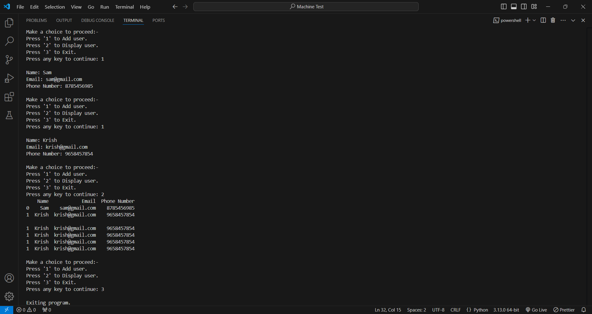

# python-machine-test

This program is a simple command-line tool for managing user information (Name, Email, and Phone Number) using an Excel file. It allows users to add new entries and display existing ones in a structured format. The program is built using Python and leverages the `openpyxl` and `pandas` libraries for Excel file manipulation and data display.

## Features

- **Add User**: Add new user details to the Excel file (Name, Email, and Phone Number).
- **Display Users**: Display all user entries stored in the Excel file.
- **Automatic File Creation**: If `Book.xlsx` does not exist, the program will automatically create it with the required headers.

## Requirements

- Python
- Required Libraries: Install these using:
  ```bash
  pip install openpyxl pandas
  ```

## How to Use

1. **Clone or Download the Project**: Save the Python file with this program on your local machine.

2. **Install Required Libraries**:

   ```bash
   pip install openpyxl pandas

   ```

3. **Run the Program**: python filename.py

4. **Choose an Option**: The program provides a menu with options:
   Press 1 to add a new user.
   Press 2 to display all user data.
   Press 3 to exit the program.

5. 
